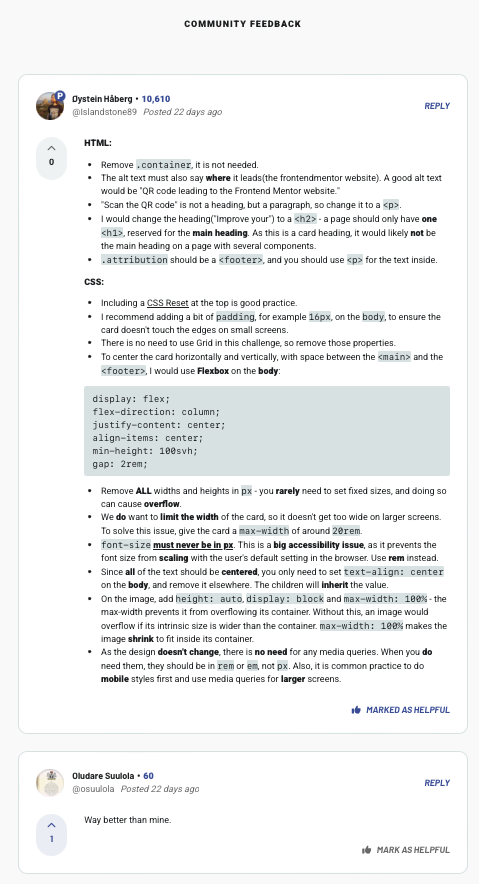

# Frontend Mentor - QR code component solution

This is a solution to the [QR code component challenge on Frontend Mentor](https://www.frontendmentor.io/challenges/qr-code-component-iux_sIO_H). Frontend Mentor challenges help you improve your coding skills by building realistic projects.

## Table of contents

- [Overview](#overview)
- [The task](#the-task)
- [Approach](#approach)
- [Screenshot](#screenshot)
- [Links](#links)
- [Built with](#built-with)
- [Lessons](#lessons)
- [Take forward](#take-forward)
- [Feedback](#feedback)

## Overview

For my first Frontend Mentor project, I had to design a static web page with a QR-code.

## The task

I was provided the design, a Figma file and the content. I was required to write the HTML and style the CSS, as well as optimise for mobile, too.

## Approach

To start, I wrote down every HTML element I could see in the design and pre-empted the rough structure in my mind before I begun. Then, I wrote up the HTML.

Then, I began to style piece by piece.

I designed with a Desktop-First Workflow which I learnt is atypical compared to Mobile-First.

## Screenshot

## Links

:jigsaw: Solution URL: (https://www.frontendmentor.io/solutions/responsive-qr-code-for-desktop-and-mobile-PELngEEDvJ)  
:pencil: Live Site URL: (https://i000o.github.io/fem-qr-challenge/)

## Built with

:gear: Semantic HTML5 markup  
:gear: CSS Flex  
:gear: Desktop-first workflow

## Lessons

1. I designed with Grid instead of Flex due to not understanding layouts well yet
2. I wrote up media queries when I didn’t need to
3. Accessibility Law requires that every page must have a h1 on it somewhere. What do we do when there isn’t an obvious one?

## Take forward

:grey_exclamation: Do the simplest thing. Don’t overdo things and give yourself unnecessary, time-consuming work.  
:grey_exclamation: Your design-eye comes in handy here… You notice things that others don’t.

## Feedback

I got positive and really helpful feedback on this project which I integrated on reflection after sharing. This included how to center content in Flexbox and style font-sizes with relative units. See below:

Source: (https://www.frontendmentor.io/solutions/responsive-qr-code-for-desktop-and-mobile-PELngEEDvJ)
